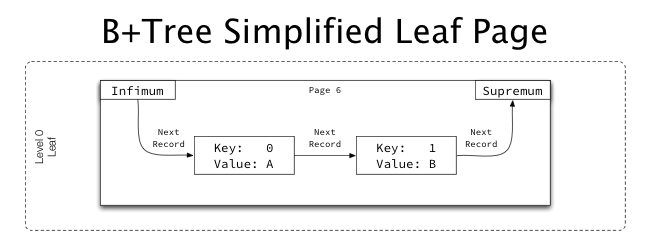
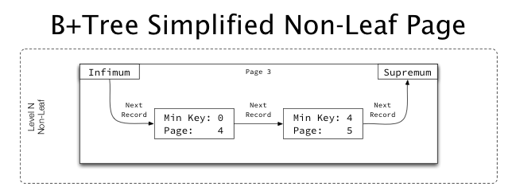
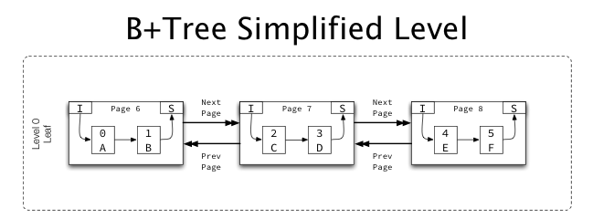
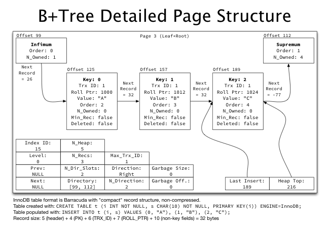

# B+Tree index structures in InnoDB

*[This [post](https://blog.jcole.us/2013/01/10/btree-index-structures-in-innodb/) refers to innodb_ruby version 0.8.8 as of February 3, 2014.]*

In [On learning InnoDB: A journey to the core](https://blog.jcole.us/2013/01/02/on-learning-innodb-a-journey-to-the-core/), I introduced the [innodb_diagrams](https://github.com/jeremycole/innodb_diagrams) project to document the InnoDB internals, which provides the diagrams used in this post. Later on in [A quick introduction to innodb_ruby](https://blog.jcole.us/2013/01/03/a-quick-introduction-to-innodb-ruby/) I walked through installation and a few quick demos of the innodb_space command-line tool.

[The physical structure of InnoDB’s INDEX pages was described in The physical structure of InnoDB index pages](https://blog.jcole.us/2013/01/07/the-physical-structure-of-innodb-index-pages/). We’ll now look into how InnoDB logically structures its indexes, using some practical examples.

## An aside on terminology: B+Tree, root, leaf, and level

InnoDB uses a [B+Tree structure](https://en.wikipedia.org/wiki/B%2B_tree) for its indexes. A B+Tree is particularly efficient when data doesn’t fit in memory and must be read from the disk, as it ensures that a fixed maximum number of reads would be required to access any data requested, based only on the depth of the tree, which scales nicely.

An index tree starts at a “root” page, whose location is fixed (and permanently stored in the InnoDB’s data dictionary) as a starting point for accessing the tree. The tree may be as small as the single root page, or as large as many millions of pages in a multi-level tree.

Pages are referred to as being “leaf” pages or “non-leaf” pages (also called “internal” or “node” pages in some contexts). Leaf pages contain actual row data. Non-leaf pages contain only pointers to other non-leaf pages, or to leaf pages. The tree is balanced, so all branches of the tree have the same depth.

InnoDB assigns each page in the tree a “level”: leaf pages are assigned level 0, and the level increments going up the tree. The root page level is based on the depth of the tree. All pages that are neither leaf pages nor the root page can also be called “internal” pages, if a distinction is important.

## Leaf and non-leaf pages

For both leaf and non-leaf pages, each record (including the infimum and supremum system records) contain a “next record” pointer, which stores an offset (within the page) to the next record. The linked list starts at infimum and links all records in ascending order by key, terminating at supremum. The records are not physically ordered within the page (they take whatever space is available at the time of insertion); their only order comes from their position in the linked list.

Leaf pages contain the non-key values as part of the “data” contained in each record:



Non-leaf pages have an identical structure, but instead of non-key fields, their “data” is the page number of the child page, and instead of an exact key, they represent the minimum key on the child page they point to:



## Pages at the same level

Most indexes contain more than one page, so multiple pages are linked together in ascending and descending order:



Each page contains pointers (in the FIL header) for “previous page” and “next page”, which for INDEX pages are used to form a doubly-linked list of pages at the same level (e.g. leaf pages, at level 0 form one list, level 1 pages form a separate list, etc.).

## A detailed look at a single-page table

Let’s take a look at most of what’s B+Tree related in a single index page:



## Create and populate the table

The test table in use in the illustration above can be created and populated with (make sure you’re using innodb_file_per_table and using Barracuda file format):

```
CREATE TABLE t_btree (
  i INT NOT NULL,
  s CHAR(10) NOT NULL,
  PRIMARY KEY(i)
) ENGINE=InnoDB;

INSERT INTO t_btree (i, s)
  VALUES (0, "A"), (1, "B"), (2, "C");
```

While this table is quite small and not realistic, it does demonstrate nicely how records and record traversal works.

## Verify the basic structure of the space file

The table should match what we’ve examined before, with the three standard overhead pages (FSP_HDR, IBUF_BITMAP, and INODE) followed by a single INDEX page for the root of the index, and in this case two unused ALLOCATED pages.

```
$ innodb_space -f t_btree.ibd space-page-type-regions
start       end         count       type                
0           0           1           FSP_HDR             
1           1           1           IBUF_BITMAP         
2           2           1           INODE               
3           3           1           INDEX               
4           5           2           FREE (ALLOCATED) 
```

The space-index-pages-summary mode will give us a count of records in each page, and is showing the expected 3 records:

```
$ innodb_space -f t_btree.ibd space-index-pages-summary
page        index   level   data    free    records 
3           18      0       96      16156   3       
4           0       0       0       16384   0       
5           0       0       0       16384   0  
```

(Note that space-index-pages-summary also shows the empty ALLOCATED pages as empty pages with zero records, since that’s often what you’re interested in for plotting purposes.)

The space-indexes mode will show the stats about our PRIMARY KEY index, which is consuming a single page on its internal file segment:

```
$ innodb_space -f t_btree.ibd space-indexes
id          root        fseg        used        allocated   fill_factor 
18          3           internal    1           1           100.00%     
18          3           leaf        0           0           0.00%     
```

## Set up a record describer

In order for innodb_ruby to parse the contents of records, we need to provide a record describer, which is just a Ruby class providing a method that returns a description of an index:

```
class SimpleTBTreeDescriber < Innodb::RecordDescriber
  type :clustered
  key "i", :INT, :NOT_NULL
  row "s", "CHAR(10)", :NOT_NULL
end
```

We need to note that this is the clustered key, provide the column descriptions for the key, and the column descriptions for the non-key (“row”) fields. It’s necessary to ask innodb_space to load this class with the following additional arguments:

```
-r -r ./simple_t_btree_describer.rb -d SimpleTBTreeDescriber
```

## Look at the record contents

The root page (which is a leaf page) in this example can be dumped using the page-dump mode and providing the page number for the root page:

```
$ innodb_space -f t_btree.ibd -r ./simple_t_btree_describer.rb -d SimpleTBTreeDescriber -p 3 page-dump
```

Aside from some parts of this output we’ve looked at before, it will now print a “records:” section with the following structure per record:

```
{:format=>:compact,
 :offset=>125,
 :header=>
  {:next=>157,
   :type=>:conventional,
   :heap_number=>2,
   :n_owned=>0,
   :min_rec=>false,
   :deleted=>false,
   :field_nulls=>nil,
   :field_lengths=>[0, 0, 0, 0],
   :field_externs=>[false, false, false, false]},
 :next=>157,
 :type=>:clustered,
 :key=>[{:name=>"i", :type=>"INT", :value=>0, :extern=>nil}],
 :transaction_id=>"0000000f4745",
 :roll_pointer=>
  {:is_insert=>true, :rseg_id=>8, :undo_log=>{:page=>312, :offset=>272}},
 :row=>[{:name=>"s", :type=>"CHAR(10)", :value=>"A", :extern=>nil}]}
```
 
This should align with the above detailed illustration perfectly, as I’ve copied most of the information from this example for accuracy. Note the following aspects:

- The :format being :compact indicates that the record is the new “compact” format in Barracuda format tables (as opposed to “redundant” in Antelope tables).
- The :key listed in the output is an array of key fields for the index, and :row is an array of non-key fields.
- The :transaction_id and :roll_pointer fields are internal fields for MVCC included in each record, since this is a clustered key (the PRIMARY KEY).
- The :next field within the :header hash is a relative offset (32) which must be added to the current record offset (125) to yield the actual offset of the next record (157). For convenience this calculated offset is included as :next in the record hash.

## Recurse the index

A nice and simple output of recursing the entire index can be achieved with the index-recurse mode, but since this is still a single-page index, the output will be very short:

```
$ innodb_space -f t_btree.ibd -r ./simple_t_btree_describer.rb -d SimpleTBTreeDescriber -p 3 index-recurse
ROOT NODE #3: 3 records, 96 bytes
  RECORD: (i=0) -> (s=A)
  RECORD: (i=1) -> (s=B)
  RECORD: (i=2) -> (s=C)
```

## Building a non-trivial index tree

A multi-level index tree (overly simplified) in InnoDB looks like:


As previously described, all pages at each level are doubly-linked to each other, and within each page, records are singly-linked in ascending order. Non-leaf pages contain “pointers” (containing the child page number) rather than non-key row data.

If we use the simpler table schema with 1 million rows created in [A quick introduction to innodb_ruby](https://blog.jcole.us/2013/01/03/a-quick-introduction-to-innodb-ruby/), the tree structure looks a little more interesting:

```
$ innodb_space -f t.ibd -r ./simple_t_describer.rb -d SimpleTDescriber -p 3 index-recurse

ROOT NODE #3: 2 records, 26 bytes
  NODE POINTER RECORD >= (i=252) -> #36
  INTERNAL NODE #36: 1117 records, 14521 bytes
    NODE POINTER RECORD >= (i=252) -> #4
    LEAF NODE #4: 446 records, 9812 bytes
      RECORD: (i=1) -> ()
      RECORD: (i=2) -> ()
      RECORD: (i=3) -> ()
      RECORD: (i=4) -> ()

<many lines omitted>

    NODE POINTER RECORD >= (i=447) -> #1676
    LEAF NODE #1676: 444 records, 9768 bytes
      RECORD: (i=447) -> ()
      RECORD: (i=448) -> ()
      RECORD: (i=449) -> ()
      RECORD: (i=450) -> ()

<many lines omitted>

    NODE POINTER RECORD >= (i=891) -> #771
    LEAF NODE #771: 512 records, 11264 bytes
      RECORD: (i=891) -> ()
      RECORD: (i=892) -> ()
      RECORD: (i=893) -> ()
      RECORD: (i=894) -> ()
```

This is a three-level index tree, which can be seen by the ROOT, INTERNAL, LEAF lines above. We can see that some pages are completely full, with 468 records consuming almost 15 KiB of the 16 KiB page.

Looking at a non-leaf page (page 36, in the above output) using the page-dump mode, records look slightly different than the leaf pages shown previously:

```
$ innodb_space -f t.ibd -r ./simple_t_describer.rb -d SimpleTDescriber -p 36 page-dump

{:format=>:compact,
 :offset=>125,
 :header=>
  {:next=>11877,
   :type=>:node_pointer,
   :heap_number=>2,
   :n_owned=>0,
   :min_rec=>true,
   :deleted=>false,
   :field_nulls=>nil,
   :field_lengths=>[0],
   :field_externs=>[false]},
 :next=>11877,
 :type=>:clustered,
 :key=>[{:name=>"i", :type=>"INT UNSIGNED", :value=>252, :extern=>nil}],
 :child_page_number=>4}
```

The :key array is present, although it represents the minimum key rather than an exact key, and no :row is present, as a :child_page_number takes its place.

The root page is a bit special

Since the root page is allocated when the index is first created, and that page number is stored in the data dictionary, the root page can never relocated or removed. Once the root page fills up, it will need to be split, forming a small tree of a root page plus two leaf pages.

However, the root page itself can’t actually be split, since it cannot be relocated. Instead, a new, empty page is allocated, the records in the root are moved there (the root is “raised” a level), and that new page is split into two. The root page then does not need to be split again until the level immediately below it has enough pages that the root becomes full of child page pointers (called “node pointers”), which in practice often means several hundred to more than a thousand.

B+Tree levels and increasing tree depth

As an example of the efficiency of B+Tree indexes, assume perfect record packing (every page full, which will never quite happen in practice, but is useful for discussion). A B+Tree index in InnoDB for the simple table in the examples above will be able to store 468 records per leaf page, or 1203 records per non-leaf page. The index tree can then be a maximum of the following sizes at the given tree heights:

| Height | Non-leaf pages | Leaf pages | Rows | Size in bytes |
| --- | --- | --- | --- | --- |
| 1 | 0 | 1 | 468 | 16.0 KiB |
| 2 | 1 | 1203 | > 563 thousand | 18.8 KiB |
| 3 | 1204 | 1447209 | > 677 million | 22.1 GiB |
| 4 | 1448413 | 1740992427 | > 814 billion | 25.9 TiB |

As you can imagine, most tables with sensible PRIMARY KEY definitions are 2-3 levels, with some achieving 4 levels. Using an excessively large PRIMARY KEY can cause the B+Tree to be much less efficient, however, since primary key values must be stored in the non-leaf pages. This can drastically inflate the size of the records in non-leaf pages, meaning many fewer of those records fit in each non-leaf page, making the whole structure less efficient.

What’s next?

Next we’ll take a look at the page directory structure in INDEX pages which mentioned several times already, and then look at how to search efficiently within InnoDB indexes.

