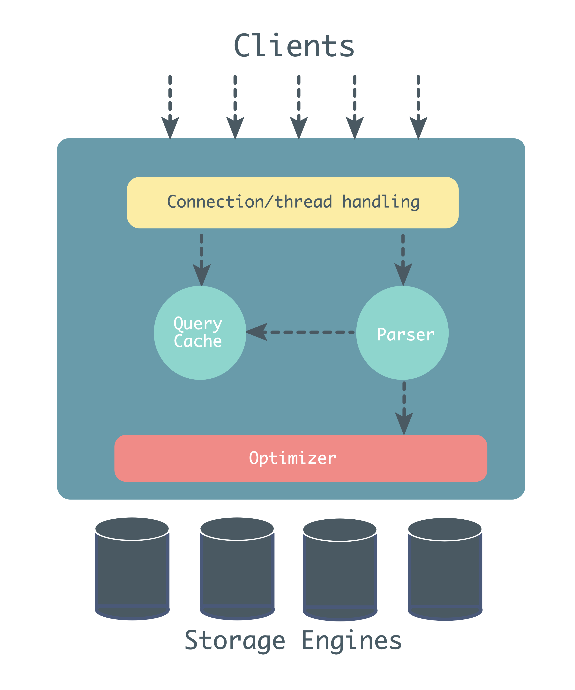

# High Performance MySQL

## MySQL Architecture and History

### MySQL’s Logical Architecture



第一层：

> connection handling, authentication, security, and so forth.

第二层：

> Much of MySQL’s brains are here, including the code for query parsing, analysis, optimization, caching, and all the built-in functions (e.g., dates, times, math, and encryption). Any functionality provided across storage engines lives at this level: stored procedures, triggers, and views, for example.

大部分功能都在这一层

第三层：

> They are responsible for storing and retrieving all data stored “in” MySQL.

> The storage engines don’t parse SQL 1 or communicate with each other; they simply respond to requests from the server.

### Concurrency Control

#### Read/Write Locks

> Systems that deal with concurrent read/write access typically implement a locking system that consists of two lock types. These locks are usually known as shared locks and exclusive locks, or read locks and write locks.

> Read locks on a resource are shared, or mutually nonblocking: many clients can read from a resource at the same time and not interfere with each other.Write locks, on the other hand, are exclusive—i.e., they block both read locks and other write locks—because the only safe policy is to have a single client writing to the resource at a given time and to prevent all reads when a client is writing.

Read locks 共享不互斥，而 Write locks 不仅仅自身互斥，而且与 Read locks 也是互斥的，但这样限制了并发能力。

#### Lock Granularity

> Minimizing the amount of data that you lock at any one time lets changes to a given resource occur simultaneously, as long as they don’t conflict with each other.
>
> The problem is locks consume resources.
> 
> A locking strategy is a compromise between lock overhead and data safety, and that compromise affects performance.
> 
> fixing the granularity at a certain level can give better performance for certain uses, yet make that engine less suited for other purposes.

通过控制锁的粒度来获得安全和资源消耗之间的平衡。

##### table locks

> ***Table locks have variations for good performance in specific situations.*** For example, READ LOCAL table locks allow some types of concurrent write operations. Write locks also have a higher priority than read locks, so a request for a write lock will advance to the front of the lock queue even if readers are already in the queue (write locks can advance past read locks in the queue, but read locks cannot advance past write locks).

锁表时，写锁相对于读锁拥有更高的优先级，因此哪怕读锁已经在队列中，新进来的写锁也会排在读锁前面。

> Although storage engines can manage their own locks, MySQL itself also uses a variety of locks that are effectively table-level for various purposes. For instance, ***the server uses a table-level lock for statements such as ALTER TABLE***, regardless of the storage engine.

无论什么引擎，`ALTER TABLE` 都是锁表。

##### Row locks

> Row locks are implemented in the storage engine, not the server (refer back to the logical architecture diagram if you need to).

行锁是在数据库引擎中实现的，并不在 server 层。

### Transactions

> ACID stands for Atomicity, Consistency, Isolation, and Durability.

事务的四个特性：原子性、一致性、隔离性、持久性。

#### Isolation Levels

> Lower isolation levels typically allow higher concurrency and have lower overhead.

更低的隔离级别意味着更高的并发，更低的消耗。

- READ UNCOMMITTED

> This level is rarely used in practice, because its performance isn’t much better than the other levels, which have many advantages.

- READ COMMITED

> This level still allows what’s known as a nonrepeatable read. This means you can run the same statement twice and see different data.

不可重复读的出现在于 `UPDATE` 和 `DELETE`

- REPEATABLE READ

> REPEATABLE READ solves the problems that READ UNCOMMITTED allows. It guarantees
that any rows a transaction reads will “look the same” in subsequent reads within the same transaction, but in theory it still allows another tricky problem: ***phantom reads***. Simply put, a phantom read can happen when you select some range of rows, another transaction ***inserts a new row into the range***, and then you select the same range again; you will then see the new “phantom” row. InnoDB and XtraDB solve the phantom read problem with multiversion concurrency control, which we explain later in this chapter.
>
> REPEATABLE READ is MySQL’s default transaction isolation level.

可重复读虽然解决了读已提交的不可能重复读的问题，但是还会出现幻读，幻读在于 `INSERT`。

如果使用锁机制来实现这种隔离级别，在可重复读中，该 sql 第一次读取到数据后，就将这些数据加锁，其它事务无法修改这些数据，就可以实现可重复读了。但这种方法却无法锁住 `INSERT` 的数据，所以当事务 A 先前读取了数据，或者修改了全部数据，事务B还是可以 `INSERT` 数据提交，这时事务 A 就会发现莫名其妙多了一条之前没有的数据，这就是幻读，不能通过行锁来避免。需要 Serializable 隔离级别 ，读用读锁，写用写锁，读锁和写锁互斥，这么做可以有效的避免幻读、不可重复读、脏读等问题，但会极大的降低数据库的并发能力。

因此实际上来讲，是使用的 Multiversion Concurrency Control (MVCC) 来实现的，MySQL 避免了幻读，Oracle 避免了不可重复读。

- SERIALIZABLE

#### Deadlocks

> To combat this problem, database systems implement various forms of deadlock detection and timeouts. The more sophisticated systems, such as the InnoDB storage engine, will notice circular dependencies and return an error instantly.

### Multiversion Concurrency Control

> Most of MySQL’s transactional storage engines don’t use a simple row-locking mechanism. Instead, they use row-level locking in conjunction with a technique for increasing concurrency known as multiversion concurrency control (MVCC).

事务的核心是锁和并发

> You can think of MVCC as a twist on row-level locking; it avoids the need for locking at all in many cases and can have much lower overhead.

MVCC 可以看作是 row-level locking 变相的实现方式。

优化事务其实就是在锁和并发之间寻找平衡。

> MVCC works by keeping a snapshot of the data as it existed at some point in time. This means transactions can see a consistent view of the data, no matter how long they run. It also means different transactions can see different data in the same tables at the same time!

数据对应多个版本，同个事务内对应同一个版本，不同事务中对应可以是不同的版本。

> ***InnoDB implements MVCC by storing with each row two additional, hidden values that record when the row was created and when it was expired (or deleted). Rather than storing the actual times at which these events occurred, the row stores the system version number at the time each event occurred. This is a number that increments each time a transaction begins. Each transaction keeps its own record of the current system version, as of the time it began. Each query has to check each row’s version numbers against the transaction’s version.*** Let’s see how this applies to particular operations when the transaction isolation level is set to REPEATABLE READ:

>`SELECT` InnoDB must examine each row to ensure that it meets two criteria:

> - a. InnoDB must find a version of the row that is at least as old as the transaction (i.e., its version must be less than or equal to the transaction’s version). This ensures that either the row existed before the transaction began, or the transaction created or altered the row.

> - b. The row’s deletion version must be undefined or greater than the transaction’s version. This ensures that the row wasn’t deleted before the transaction began. Rows that pass both tests may be returned as the query’s result.

> `INSERT` InnoDB records the current system version number with the new row. 

> `DELETE` InnoDB records the current system version number as the row’s deletion ID.

> `UPDATE` InnoDB writes a new copy of the row, using the system version number for the new row’s version. It also writes the system version number as the old row’s deletion version.

上述的规则保证了可重复读的隔离级别。

> MVCC works only with the REPEATABLE READ and READ COMMITTED isolation levels.


如上图中，当前查询对应的 SCN(System Change Number) 是 10023，只会查询 SCN 小于等于 10023 的记录。

## Profiling Server Performance

### Introduction to Performance Optimization

> Our definition is that performance is measured by the time required to complete a task. In other words, ***performance is response time***.
> 
> A database server’s performance is measured by query response time, and the unit of measurement is time per query.
> 
> But this is a trap. Resources are there to be consumed. Sometimes making things faster requires that you increase resource consumption. We’ve upgraded many times from an old version of MySQL with an ancient version of InnoDB, and witnessed a dramatic increase in CPU utilization as a result. This is usually nothing to be concerned about. It usually means that the newer version of InnoDB is spending more time doing useful work and less time fighting with itself.
> 
> So if the goal is to reduce response time, we need to understand why the server requires a certain amount of time to respond to a query, and reduce or eliminate whatever unnecessary work it’s doing to achieve the result. In other words, we need to measure where the time goes. This leads to our second important principle of optimization: ***you cannot reliably optimize what you cannot measure***. 
> 
> First, some tasks aren’t worth optimizing because they contribute such a small portion of response time overall. Because of Amdahl’s Law, a query that consumes only 5% of total response time can contribute only 5% to overall speedup, no matter how much faster you make it. Second, if it costs you a thousand dollars to optimize a task and the business ends up making no additional money as a result, you just deoptimized the business by a thousand dollars. Thus, optimization should halt when the cost of improvement outweighs the benefit.

## Optimizing Schema and Data Types

### Choosing Optimal Data Types

> Avoid NULL if possible.
> 
> ***A lot of tables include nullable columns even when the application does not need to store NULL (the absence of a value), merely because it’s the default. It’s usually best to specify columns as NOT NULL unless you intend to store NULL in them.***
>
> It’s harder for MySQL to optimize queries that refer to nullable columns, because they make indexes, index statistics, and value comparisons more complicated. ***A nullable column uses more storage space and requires special processing inside MySQL. When a nullable column is indexed, it requires an extra byte per entry and can even cause a fixed-size index (such as an index on a single integer column) to be converted to a variable-sized one in MyISAM.***
>
> ***The performance improvement from changing NULL columns to NOT NULL is usually small, so don’t make it a priority to find and change them on an existing schema unless you know they are causing problems.*** However, ***if you’re planning to index columns, avoid making them nullable if possible.***
>
> There are exceptions, of course. For example, it’s worth mentioning that ***InnoDB stores NULL with a single bit, so it can be pretty space-efficient for sparsely populated data.*** This doesn’t apply to MyISAM, though.

#### Real Numbers

> The DECIMAL type is for storing exact fractional numbers. In MySQL 5.0 and newer, the DECIMAL type supports exact math. MySQL 4.1 and earlier used floating-point math to perform computations on DECIMAL values, which could give strange results because of loss of precision. In these versions of MySQL, ***DECIMAL was only a “storage type***.”
>
> The server itself performs DECIMAL math in MySQL 5.0 and newer, ***because CPUs don’t support the computations directly. Floating-point math is significantly faster, because the CPU performs the computations natively.***

对于低版本的 MySQL，Decimal 只是一个存储类型，实际运算的时候仍是浮点数运算，因此会丢失精度。CPU 并不支持 Decimal 的直接运算，所以高版本的 MySQL 会在自身的 Server 中进行 Decimal 的运算。

> DECIMAL numbers were converted to DOUBLEs for computational purposes
>
> Floating-point types typically use less space than DECIMAL to store the same range of values. A FLOAT column uses four bytes of storage. DOUBLE consumes eight bytes and has greater precision and a larger range of values than FLOAT. ***As with integers, you’re choosing only the storage type; MySQL uses DOUBLE for its internal calculations on floating-point types.***
> 
> ***Because of the additional space requirements and computational cost, you should use DECIMAL only when you need exact results for fractional numbers***—for example, when storing financial data. ***But in some high-volume cases it actually makes sense to use a BIGINT instead, and store the data as some multiple of the smallest fraction of currency you need to handle.*** Suppose you are required to store financial data to the tenthousandth of a cent. ***You can multiply all dollar amounts by a million and store the result in a BIGINT, avoiding both the imprecision of floating-point storage and the cost of the precise DECIMAL math.***

#### String Types

##### VARCHAR and CHAR types

> VARCHAR stores variable-length character strings and is the most common string data type. It can require less storage space than fixed-length types, because it uses only as much space as it needs (i.e., less space is used to store shorter values).
> 
> VARCHAR uses 1 or 2 extra bytes to record the value’s length: 1 byte if the column’s maximum length is 255 bytes or less, and 2 bytes if it’s more.
> 
> VARCHAR helps performance because it saves space. However, because the rows are variable-length, they can grow when you update them, which can cause extra work.

VARCHAR 不设定长度虽然可以节省空间，但是在进行更新增加长度的时候会有额外的资源消耗，所以在创建表的时候都会设置一个长度。

> CHAR is fixed-length: MySQL always allocates enough space for the specified number of characters. When storing a CHAR value, MySQL removes any trailing spaces.
> 
> CHAR is useful if you want to store very short strings, or if all the values are nearly the same length. For example, CHAR is a good choice for MD5 values for user passwords, which are always the same length. CHAR is also better than VARCHAR for data that’s changed frequently, because a fixed-length row is not prone to fragmentation. For very short columns, CHAR is also more efficient than VARCHAR; a CHAR(1) designed to hold only Y and N values will use only one byte in a single-byte character set, 1 but a VARCHAR(1) would use two bytes because of the length byte.

#### Date and Time Types

> The finest granularity of time MySQL can store is one second.

##### DATETIME

> This uses eight bytes of storage space.

##### TIMESTAMP

> TIMESTAMP uses only four bytes of storage

DATETIME 会随着时区的改变而改变，而 TIMESTAMP 不会，所以一般都是使用 DATETIME。

#### Choosing Identifiers

> As we demonstrated earlier in this chapter, it’s a good idea to use the same data types in related tables, because you’re likely to use them for joins.

> ***MySQL does index NULLs, unlike Oracle, which doesn’t include non-values in indexes***.

#### Normalization and Denormalization

##### Pros and Cons of a Normalized Schema

> People who ask for help with performance issues are frequently advised to normalize their schemas, especially if the workload is write-heavy. This is often good advice. It works well for the following reasons:
>> - Normalized updates are usually faster than denormalized updates.
>> - When the data is well normalized, there’s little or no duplicated data, so there’s less data to change.
>> - Normalized tables are usually smaller, so they fit better in memory and perform better.
>> - The lack of redundant data means there’s less need for DISTINCT or GROUP BY queries when retrieving lists of values. Consider the preceding example: it’s impossible to get a distinct list of departments from the denormalized schema without DIS TINCT or GROUP BY, but if DEPARTMENT is a separate table, it’s a trivial query.
>
> ***The drawbacks of a normalized schema usually have to do with retrieval. Any nontrivial query on a well-normalized schema will probably require at least one join, and perhaps several.*** This is not only expensive, but it can make some indexing strategies impossible. For example, normalizing may place columns in different tables that would benefit from belonging to the same index.

##### A Mixture of Normalized and Denormalized

关键就是在这两者间寻找平衡点

#### Cache and Summary Tables

> ***When you rebuild summary and cache tables, you’ll often need their data to remain available during the operation. You can achieve this by using a “shadow table,” which is a table you build “behind” the real table.*** When you’re done building it, you can swap the tables with an atomic rename. For example, if you need to rebuild my_summary, you can create my_summary_new, fill it with data, and swap it with the real table:

>
```
mysql> DROP TABLE IF EXISTS my_summary_new, my_summary_old; 
mysql> CREATE TABLE my_summary_new LIKE my_summary; 
-- populate my_summary_new as desired 
mysql> RENAME TABLE my_summary TO my_summary_old, my_summary_new TO my_summary;
```
> If you rename the original my_summary table my_summary_old before assigning the name my_summary to the newly rebuilt table, as we’ve done here, you can keep the old version until you’re ready to overwrite it at the next rebuild. It’s handy to have it for a quick rollback if the new table has a problem.

这里之所以要将原表更名为 old ，新表替换原表工作，是因为可以检测新表是否有问题，若有问题则可以迅速回滚。

##### Materialized Views

- Materialized views are disk based and are updated periodically based upon the query definition.
- Views are virtual only and run the query definition each time they are accessed.

##### Counter Tables

> An application that keeps counts in a table can run into concurrency problems when updating the counters. Such tables are very common in web applications. You can use them to cache the number of friends a user has, the number of downloads of a file, and so on. It’s often a good idea to build a separate table for the counters, to keep it small and fast. Using a separate table can help you avoid query cache invalidations and lets you use some of the more advanced techniques we show in this section.
> 
> To keep things as simple as possible, suppose you have a counter table with a single row that just counts hits on your website:
>
```
mysql> CREATE TABLE hit_counter (
    -> cnt int unsigned not null 
    -> ) ENGINE=InnoDB;
``` 
>
> Each hit on the website updates the counter:
> 
```
mysql> UPDATE hit_counter SET cnt = cnt + 1;
```
> 
> The problem is that this single row is effectively a global “mutex” for any transaction that updates the counter. It will serialize those transactions. You can get higher concurrency by keeping more than one row and updating a random row. This requires the following change to the table:
> 
```
mysql> CREATE TABLE hit_counter (
    -> slot tinyint unsigned not null primary key, 
    -> cnt int unsigned not null 
    -> ) ENGINE=InnoDB;
```
>
> Prepopulate the table by adding 100 rows to it. Now the query can just choose a random slot and update it:
>
```
mysql> UPDATE hit_counter SET cnt = cnt + 1 WHERE slot = RAND() * 100;
```
>
> To retrieve statistics, just use aggregate queries:
> 
```
mysql> SELECT SUM(cnt) FROM hit_counter;
```
>

通过预置的记录，随机增加 cnt，避免在同一条记录上更新时的互斥。（以前都没有过这样的思路）

> A common requirement is to start new counters every so often (for example, once a day). If you need to do this, you can change the schema slightly:
> 
```
mysql> CREATE TABLE daily_hit_counter (
    -> day date not null, 
    -> slot tinyint unsigned not null, 
    -> cnt int unsigned not null, 
    -> primary key(day, slot) 
    -> ) ENGINE=InnoDB;
```
>
> You don’t want to pregenerate rows for this scenario. Instead, you can use ON DUPLICATE KEY UPDATE:
> 
```
mysql> INSERT INTO daily_hit_counter(day, slot, cnt) 
    -> VALUES(CURRENT_DATE, RAND() * 100, 1) 
    -> ON DUPLICATE KEY UPDATE cnt = cnt + 1;
```
>
> If you want to reduce the number of rows to keep the table smaller, you can write a periodic job that merges all the results into slot 0 and deletes every other slot:
> 
```
mysql> UPDATE daily_hit_counter as c 
    -> INNER JOIN ( 
    -> SELECT day, SUM(cnt) AS cnt, MIN(slot) AS mslot 
    -> FROM daily_hit_counter 
    -> GROUP BY day 
    -> ) AS x USING(day) 
    -> SET c.cnt = IF(c.slot = x.mslot, x.cnt, 0), 
    -> c.slot = IF(c.slot = x.mslot, 0, c.slot); 
mysql> DELETE FROM daily_hit_counter WHERE slot <> 0 AND cnt = 0;
```

将所有的计数记录都合并到一条记录，将其他所有记录删除来减少表内的记录数。

## Indexing for High Performance

### Indexing Basics

> An index contains values from one or more columns in a table. If you index more than one column, the column order is very important, because MySQL can only search efficiently on a leftmost prefix of the index. Creating an index on two columns is not the same as creating two separate single-column indexes, as you’ll see.

举例说明下：

```
SELECT * FROM table WHERE first_name="john" AND last_name="doe"
SELECT * FROM table WHERE first_name="john"
SELECT * FROM table WHERE last_name="doe"
```

如果索引是 (`first_time`, `last_name`) 则 1 和 2 语句会用到索引，而 3 不会。如果索引是 (`last_name`, `first_time`) 则 1 和 3 语句可以用到索引，而 2 不会。

因为 MySQL 的索引是 B+Tree 数据结构，表中的数据本身就是按照 B+Tree 的数据结构组成。最左匹配原则 (leftmost prefix of the index) 的原因也是来自于 B+Tree 的数据结构。

索引建立的时候 root page 是地址是不变的，其他的 page 都是根据 root page 衍生，因此才有了最左匹配原则。具体可以参见 [Jeremy Cole](https://blog.jcole.us/) 的文章 “[B+Tree index structures in InnoDB](B+Tree-index-structures-in-InnoDB.md)”。

#### Types of Indexes

> There are many types of indexes, each designed to perform well for different purposes. Indexes are implemented in the storage engine layer, not the server layer. Thus, they are not standardized: indexing works slightly differently in each engine, and not all engines support all types of indexes. Even when multiple engines support the same index type, they might implement it differently under the hood.

##### B-Tree indexes

> MyISAM uses a prefix compression technique that makes indexes smaller, but InnoDB leaves values uncompressed in its indexes. Also, MyISAM indexes refer to the indexed rows by their physical storage locations, but InnoDB refers to them by their primary key values.

InnoDB 的索引不是直接指向对应的记录，而是通过主键。其实如果直接获取建立索引列的值，是可以直接从索引中获取的，不需要读取对应行，因为 InnoDB 的索引就是值的复制。

> Notice that the index sorts the values according to the order of the columns given in the index in the CREATE TABLE statement. Look at the last two entries: there are two people with the same name but different birth dates, and they’re sorted by birth date.

这里提到的按照索引创建的顺序排列，也就是上面的按照 root page 衍生。

> Here are some limitations of B-Tree indexes:
> 
> - They are not useful if the lookup does not start from the leftmost side of the indexed columns.
> - You can’t skip columns in the index.
> - ***The storage engine can’t optimize accesses with any columns to the right of the first range condition.***For example, if your query is WHERE last_name="Smith" AND first_name LIKE 'J%' AND dob='1976-12-23', the index access will use only the first two columns in the index, because the LIKE is a range condition (the server can use the rest of the columns for other purposes, though).

##### Hash indexes

> A hash index is built on a hash table and is useful only for exact lookups that use every column in the index. 4 For each row, the storage engine computes a hash code of the indexed columns, which is a small value that will probably differ from the hash codes computed for other rows with different key values. It stores the hash codes in the index and stores a pointer to each row in a hash table.
>
> In MySQL, ***only the Memory storage engine supports explicit hash indexes.*** They are the default index type for Memory tables, though Memory tables can have B-Tree indexes, too. The Memory engine supports nonunique hash indexes, which is unusual in the database world. ***If multiple values have the same hash code, the index will store their row pointers in the same hash table entry, using a linked list.***

这里提到的 “row pointers” ，是指向对应行的主键。

> hash indexes have some limitations:
> 
> - Because the index contains only hash codes and row pointers rather than the values themselves, MySQL can’t use the values in the index to avoid reading the rows. Fortunately, accessing the in-memory rows is very fast, so this doesn’t usually degrade performance.
> - MySQL can’t use hash indexes for sorting because they don’t store rows in sorted order.
> - Hash indexes don’t support partial key matching, because they compute the hash from the entire indexed value. That is, if you have an index on (A,B) and your query’s WHERE clause refers only to A, the index won’t help.
> - Hash indexes support only equality comparisons that use the =, IN(), and <=> operators (note that <> and <=> are not the same operator). They can’t speed up range queries, such as WHERE price > 100.
> - Accessing data in a hash index is very quick, unless there are many collisions (multiple values with the same hash).
> - Some index maintenance operations can be slow if there are many hash collisions.

上面的这些缺点，使得 Hash indexes 只会在一些特殊场景使用。

> The InnoDB storage engine has a special feature called ***adaptive hash indexes***. When InnoDB notices that some index values are being accessed very frequently, it builds a hash index for them in memory on top of B-Tree indexes. This gives its B-Tree indexes some properties of hash indexes, such as very fast hashed lookups. This process is completely automatic, and you can’t control or configure it, although you can disable the adaptive hash index altogether.

InnoDB 会自动给频繁获取的数据在 B-Tree 索引上建立 hash index 来加快查找，不需要额外的配置。

> Building your own hash indexes. If your storage engine doesn’t support hash indexes, you
> 
> can emulate them yourself in a manner similar to that InnoDB uses. This will give you access to some of the desirable properties of hash indexes, such as a very small index size for very long keys.
> 
> The idea is simple: ***create a pseudohash index on top of a standard B-Tree index. It will not be exactly the same thing as a real hash index, because it will still use the B-Tree index for lookups. However, it will use the keys’ hash values for lookups, instead of the keys themselves.*** All you need to do is specify the hash function manually in the query’s WHERE clause.

对于不支持 hash indexes 的数据库可以自己通过一个 hash 函数来手动建立 hash indexes。比如说一个字段是很长的网址，这个时候就可以用 hash 函数对其生成一个 hash code，手动建立 hash indexes。

> One ***drawback*** to this approach is the need to maintain the hash values. You can do this manually or, in MySQL 5.0 and newer, you can use triggers. The following example shows how triggers can help maintain the url_crc column when you insert and update values.

在 MySQL 5.0 之后，可以使用触发器，在新纪录插入的时候用 hash 函数对其生成对应的 hash code 存入额外的字段内，作为手动的 hash indexes。

> Make sure you use a function that returns an integer, not a string.

生成的 hash code 最好是 integer 而不是 String。

> ***Handling hash collisions.*** When you search for a value by its hash, you must also include the literal value in your WHERE clause.

当 hash code 一致的时候（如下）就会返回多条记录。

```
mysql> SELECT id FROM url WHERE url_crc=CRC32("http://www.mysql.com");
```

这个时候就可以将原有的字段加到 `WHERE` 语句中。

```
mysql> SELECT id FROM url WHERE url_crc=CRC32("http://www.mysql.com") 
    -> AND url="http://www.mysql.com";
```

### Benefits of Indexes

> ***B-Tree indexes, which are the most common type you’ll use, function by storing the data in sorted order, and MySQL can exploit that for queries with clauses such as ORDER BY and GROUP BY. Because the data is presorted, a B-Tree index also stores related values close together.*** Finally, ***the index actually stores a copy of the values***, so some queries can be satisfied from the index alone.

### Indexing Strategies for High Performance

#### Prefix Indexes and Index Selectivity

> Prefix indexes can be a great way to make indexes smaller and faster, but they have downsides too: MySQL cannot use prefix indexes for ORDER BY or GROUP BY queries, nor can it use them as covering indexes.

#### Multicolumn Indexes

> Multicolumn indexes are often very poorly understood. Common mistakes are to index many or all of the columns separately, or to index columns in the wrong order.
> 
> This strategy of indexing often results when people give vague but authoritativesounding advice such as “create indexes on columns that appear in the WHERE clause.” This advice is very wrong. It will result in one-star indexes at best. 
> 
> it’s much better to ignore the WHERE clause and pay attention to optimal row order or create a covering index instead.
> 
> Individual indexes on lots of columns won’t help MySQL improve performance for most queries. MySQL 5.0 and newer can cope a little with such poorly indexed tables by using a strategy known as index merge, which permits a query to make limited use of multiple indexes from a single table to locate desired rows. Earlier versions of MySQL could use only a single index, so when no single index was good enough to help, MySQL often chose a table scan. For example, the film_actor table has an index on film_id and an index on actor_id, but neither is a good choice for both WHERE conditions in this query:
> 
```
mysql> SELECT film_id, actor_id FROM sakila.film_actor 
    -> WHERE actor_id = 1 OR film_id = 1;
```
>
> In older MySQL versions, that query would produce a table scan unless you wrote it as the UNION of two queries
> 
```
mysql> SELECT film_id, actor_id FROM sakila.film_actor WHERE actor_id = 1 
    -> UNION ALL 
    -> SELECT film_id, actor_id FROM sakila.film_actor WHERE film_id = 1 
    -> AND actor_id <> 1;
```
>
> In MySQL 5.0 and newer, however, the query can use both indexes, scanning them simultaneously and merging the results. There are three variations on the algorithm: union for OR conditions, intersection for AND conditions, and unions of intersections for combinations of the two. The following query uses a union of two index scans, as you can see by examining the Extra column:
> 
```
mysql> EXPLAIN SELECT film_id, actor_id FROM sakila.film_actor 
-> WHERE actor_id = 1 OR film_id = 1\G 
*************************** 1. row ***************************
 id: 1 
 select_type: SIMPLE 
 table: film_actor 
 type: index_merge 
 possible_keys: PRIMARY,idx_fk_film_id 
 key: PRIMARY,idx_fk_film_id 
 key_len: 2,2 
 ref: NULL rows: 29 
 Extra: Using union(PRIMARY,idx_fk_film_id); Using where
```
> 
> MySQL can use this technique on complex queries, so you might see nested operations in the Extra column for some queries.

在 MySQL 5.0 以上，对于多个单独的索引，搜索引擎会合并这些索引，叫做 index merge。具体可以参见 [index merge optimization](https://dev.mysql.com/doc/refman/5.7/en/index-merge-optimization.html)。

#### Choosing a Good Column Order

> ***The order of columns in a multicolumn B-Tree index means that the index is sorted first by the leftmost column, then by the next column, and so on.***Therefore, the index can be scanned in either forward or reverse order, to satisfy queries with ORDER BY, GROUP BY, and DISTINCT clauses that match the column order exactly.
> 
> There is an old rule of thumb for choosing column order: ***place the most selective columns first in the index***. How useful is this suggestion? It can be helpful in some cases, but it’s usually much less important than avoiding random I/O and sorting, all things considered. (Specific cases vary, so there’s no one-size-fits-all rule. That alone should tell you that this rule of thumb is probably less important than you think.)

将唯一性最高的列放在复合索引的前面，这样可以避免随机的 I/O 读写和排序。

#### Clustered Indexes

> Clustered indexes 6 aren’t a separate type of index. Rather, they’re an approach to data storage. The exact details vary between implementations, but InnoDB’s clustered indexes actually store a B-Tree index and the rows together in the same structure.
> 
> When a table has a clustered index, its rows are actually stored in the index’s leaf pages. The term “clustered” refers to the fact that rows with adjacent key values are stored close to each other. 
> 
> That means that to find a row from a secondary index, the storage engine first finds the leaf node in the secondary index and then uses the primary key values stored there to navigate the primary key and find the row. That’s double work: two B-Tree navigations instead of one. 8 In InnoDB, the adaptive hash index can help reduce this penalty.

如果一个表有聚合索引，那么他的行记录实际上是存放在索引的 leaf pages 中的，所以获取所有列时会相当快。而不像非聚合索引那样，先寻找到 secondary indexes 再到主键，根据主键获取对应的记录。

StackOverflow 中对于聚合索引的解释：

> With a clustered index the rows are stored physically on the disk in the same order as the index. Therefore, there can be only one clustered index.
> 
> With a non clustered index there is a second list that has pointers to the physical rows. You can have many non clustered indexes, although each new index will increase the time it takes to write new records.
> 
> It is generally faster to read from a clustered index if you want to get back all the columns. You do not have to go first to the index and then to the table.
> 
> Writing to a table with a clustered index can be slower, if there is a need to rearrange the data.

#### Using Index Scans for Sorts

> Ordering the results by the index works only when the index’s order is exactly the same as the ORDER BY clause and all columns are sorted in the same direction (ascending or descending). If the query joins multiple tables, it works only when all columns in the ORDER BY clause refer to the first table. The ORDER BY clause also has the same limitation as lookup queries: it needs to form a leftmost prefix of the index. In all other cases, MySQL uses a sort.
> 
> One case where the ORDER BY clause doesn’t have to specify a leftmost prefix of the index is if there are constants for the leading columns. If the WHERE clause or a JOIN clause specifies constants for these columns, they can “fill the gaps” in the index.
>
> For example, the rental table in the standard Sakila sample database has an index on (rental_date, inventory_id, customer_id):
>
```
CREATE TABLE rental (
...
PRIMARY KEY (rental_id),
UNIQUE KEY rental_date (rental_date,inventory_id,customer_id), 
KEY idx_fk_inventory_id (inventory_id), 
KEY idx_fk_customer_id (customer_id), 
KEY idx_fk_staff_id (staff_id), ...
);
```
>
> MySQL uses the rental_date index to order the following query, as you can see from the lack of a filesort in EXPLAIN:
> 
```
mysql> EXPLAIN SELECT rental_id, staff_id FROM sakila.rental 
    -> WHERE rental_date = '2005-05-25' 
    -> ORDER BY inventory_id, customer_id\G 
    *************************** 1. row *************************** 
    type: ref 
    possible_keys: rental_date 
    key: rental_date 
    rows: 1 
    Extra: Using where
```
>
> This works, even though the ORDER BY clause isn’t itself a leftmost prefix of the index, because we specified an equality condition for the first column in the index.
>
> Here are some more queries that can use the index for sorting. This one works because the query provides a constant for the first column of the index and specifies an ORDER BY on the second column. Taken together, those two form a leftmost prefix on the index:
> 
```
... WHERE rental_date = '2005-05-25' ORDER BY inventory_id DESC;
```
>
>The following query also works, because the two columns in the ORDER BY are a leftmost prefix of the index:
>
```
... WHERE rental_date > '2005-05-25' ORDER BY rental_date, inventory_id;
```
> Here are some queries that cannot use the index for sorting:
>
> - This query uses two different sort directions, but the index’s columns are all sorted ascending:
> 
> ```
> ... WHERE rental_date = '2005-05-25' ORDER BY inventory_id DESC, customer_id ASC;
> ```
> 
> - Here, the ORDER BY refers to a column that isn’t in the index:
> 
> ```
> ... WHERE rental_date = '2005-05-25' ORDER BY inventory_id, staff_id;
> ```
> 
> - Here, the WHERE and the ORDER BY don’t form a leftmost prefix of the index:
> 
> ```
> ... WHERE rental_date = '2005-05-25' ORDER BY customer_id;
> ```
> 
> - This query has a range condition on the first column, so MySQL doesn’t use the rest of the index:
> 
> ```
> ... WHERE rental_date > '2005-05-25' ORDER BY inventory_id, customer_id;
> ```
> 
> - Here there’s a multiple equality on the inventory_id column. For the purposes of sorting, this is basically the same as a range:
> 
> ```
> ... WHERE rental_date = '2005-05-25' AND inventory_id IN(1,2) ORDER BY customer_ id;
> ```
> 
> Here’s an example where MySQL could theoretically use an index to order a join, but doesn’t because the optimizer places the film_actor table second in the join (the next chapter shows ways to change the join order):
> 
> ```
> mysql> EXPLAIN SELECT actor_id, title FROM sakila.film_actor 
>     -> INNER JOIN sakila.film USING(film_id) ORDER BY actor_id\G
>  +------------+----------------------------------------------+
>  | table | Extra                                             | 
>  +------------+----------------------------------------------+ 
>  | film | Using index; Using temporary; Using filesort       | 
>  | film_actor | Using index                                  | 
>  +------------+----------------------------------------------+
> ```
> 
> One of the most important uses for ordering by an index is a query that has both an ORDER BY and a LIMIT clause. We explore this in more detail later.

#### Packed (Prefix-Compressed) Indexes

> Redundant indexes are a bit different from duplicated indexes. If there is an index on (A, B), another index on (A) would be redundant because it is a prefix of the first index. That is, the index on (A, B) can also be used as an index on (A) alone. (This type of redundancy applies only to B-Tree indexes.) However, an index on (B, A) would not be redundant, and neither would an index on (B), because B is not a leftmost prefix of (A, B). Furthermore, indexes of different types (such as hash or full-text indexes) are not redundant to B-Tree indexes, no matter what columns they cover.

#### Indexes and Locking

> Indexes permit queries to lock fewer rows. If your queries never touch rows they don’t need, they’ll lock fewer rows, and that’s better for performance for two reasons. First, even though InnoDB’s row locks are very efficient and use very little memory, there’s still some overhead involved in row locking. Secondly, locking more rows than needed increases lock contention and reduces concurrency.
>
> InnoDB locks rows only when it accesses them, and an index can reduce the number of rows InnoDB accesses and therefore locks. However, this works only if InnoDB can filter out the undesired rows at the storage engine level. If the index doesn’t permit InnoDB to do that, the MySQL server will have to apply a WHERE clause after InnoDB retrieves the rows and returns them to the server level. 17 At this point, it’s too late to avoid locking the rows: InnoDB will already have locked them, and they will remain locked for some period of time. In MySQL 5.1 and newer, InnoDB can unlock rows after the server filters them out; in older versions of MySQL, InnoDB doesn’t unlock the rows until the transaction commits.
> 
> This is easier to see with an example. We use the Sakila sample database again:
> 
> ```
> mysql> SET AUTOCOMMIT=0; 
> mysql> BEGIN; 
> mysql> SELECT actor_id FROM sakila.actor WHERE actor_id < 5 -> AND actor_id <> 1 FOR UPDATE; 
> +----------+ 
> | actor_id | 
> +----------+ 
> | 2        | 
> | 3        | 
> | 4        | 
> +----------+
> ```
> 
> ***This query returns only rows 2 through 4, but it actually gets exclusive locks on rows 1 through 4. InnoDB locked row 1 because the plan MySQL chose for this query was an index range access***:
> 
> ```
> mysql> EXPLAIN SELECT actor_id FROM sakila.actor 
>     -> WHERE actor_id < 5 AND actor_id <> 1 FOR UPDATE;
> +----+-------------+-------+-------+---------+--------------------------+ 
> | id | select_type | table | type  | key     | Extra                    |
> +----+-------------+-------+-------+---------+--------------------------+ 
> | 1  | SIMPLE      | actor | range | PRIMARY | Using where; Using index | 
> +----+-------------+-------+-------+---------+--------------------------+
> ```
> 
> In other words, the low-level storage engine operation was “begin at the start of the index and fetch all rows until actor_id < 5 is false.” The server didn’t tell InnoDB about the WHERE condition that eliminated row 1. Note the presence of “Using where” in the Extra column in EXPLAIN. This indicates that the MySQL server is applying a WHERE filter after the storage engine returns the rows.
>
> Here’s a second query that proves row 1 is locked, even though it didn’t appear in the results from the first query. Leaving the first connection open, start a second connection and execute the following:
> 
> ```
> mysql> SET AUTOCOMMIT=0; 
> mysql> BEGIN; 
> mysql> SELECT actor_id FROM sakila.actor WHERE actor_id = 1 FOR UPDATE;
> ```
> 
> The query will hang, waiting for the first transaction to release the lock on row 1. This behavior is necessary for statement-based replication to work correctly. 
> 
> As this example shows, InnoDB can lock rows it doesn’t really need even when it uses an index. The problem is even worse when it can’t use an index to find and lock the rows: if there’s no index for the query, MySQL will do a full table scan and lock every row, whether it “needs” it or not.
> 
> Here’s a little-known detail about InnoDB, indexes, and locking: InnoDB can place shared (read) locks on secondary indexes, but exclusive (write) locks require access to the primary key. That eliminates the possibility of using a covering index and can make `SELECT FOR UPDATE` much slower than `LOCK IN SHARE MODE` or a nonlocking query.

#### Supporting Many Kinds of Filtering

> The range condition makes MySQL ignore any further columns in the index, but the multiple equality condition doesn’t have that limitation.

因为范围的条件会使其后的字段不能使用索引，所以当有多个范围条件的时候只有一个能使用索引，这个时候将范围条件用 `IN` 改成等于的条件。

#### Optimizing Sorts

> Even with the index, the query can be slow if the user interface is paginated and someone requests a page that’s not near the beginning. This case creates a bad combination of ORDER BY and LIMIT with an offset:
> 
> ```
> mysql> SELECT <cols> FROM profiles WHERE sex='M' ORDER BY rating LIMIT 100000, 10;
> ```
> 
> Such queries can be a serious problem no matter how they’re indexed, because the high offset requires them to spend most of their time scanning a lot of data that they will then throw away. Denormalizing, precomputing, and caching are likely to be the only strategies that work for queries like this one. An even better strategy is to limit the number of pages you let the user view. This is unlikely to impact the user’s experience, because no one really cares about the 10,000th page of search results.
> 
> Another good strategy for optimizing such queries is to use a deferred join, which again is our term for using a covering index to retrieve just the primary key columns of the rows you’ll eventually retrieve. You can then join this back to the table to retrieve all desired columns. This helps minimize the amount of work MySQL must do gathering data that it will only throw away. Here’s an example that requires an index on (sex, rating) to work efficiently:
> 
> ```
> mysql> SELECT <cols> FROM profiles INNER JOIN (
>     -> SELECT <primary key cols> FROM profiles 
>     -> WHERE x.sex='M' ORDER BY rating LIMIT 100000, 10 
>     -> ) AS x USING(<primary key cols>);
> ```
> 

## Query Performance Optimization

### Slow Query Basics: Optimize Data Access

> The most basic reason a query doesn’t perform well is because it’s working with too much data. Some queries just have to sift through a lot of data and can’t be helped. That’s unusual, though; most bad queries can be changed to access less data. We’ve found it useful to analyze a poorly performing query in two steps:
>
> 1. Find out whether your application is retrieving more data than you need. That usually means it’s accessing too many rows, but it might also be accessing too many columns.

> 2. Find out whether the MySQL server is analyzing more rows than it needs.

#### Are You Asking the Database for Data You Don’t Need?

> One common mistake is assuming that MySQL provides results on demand, rather than calculating and returning the full result set. We often see this in applications designed by people familiar with other database systems. These developers are used to techniques such as issuing a SELECT statement that returns many rows, then fetching the first N rows and closing the result set (e.g., fetching the 100 most recent articles for a news site when they only need to show 10 of them on the front page). They think MySQL will provide them with these 10 rows and stop executing the query, but what MySQL really does is generate the complete result set. The client library then fetches all the data and discards most of it. ***The best solution is to add a LIMIT clause to the query.***

分页的目的和上面所讲的是一致的，只获取当前需要的。

---

下面这两点记录一下，书中比较零散。

- `JOIN` 的执行是呈指数级增长的，总是前两个表的结果集再和后面的表去关联查询。
- 在结果集比较大的情况下，`EXISTS` 比 `IN` 要好，MySQL 中 `IN` 中的子查询实际执行过程中并不是先执行子查询。而是通过与外表建立连接，改写原本的 SQL。改写后的 SQL 会根据主表的每一行去与子表匹配。
    
    - `EXISTS` executes at high speed against `IN` : when the subquery results is very large.
    - `IN` gets ahead of `EXISTS` : when the subquery results is very small.


剩下的内容因为偏运维就没有涉及。


