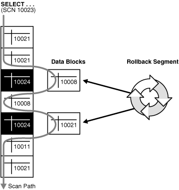

# High Performance MySQL

## MySQL Architecture and History

### MySQL’s Logical Architecture

第一层：

> connection handling, authentication, security, and so forth.

第二层：

> Much of MySQL’s brains are here, including the code for query parsing, analysis, optimization, caching, and all the built-in functions (e.g., dates, times, math, and encryption). Any functionality provided across storage engines lives at this level: stored procedures, triggers, and views, for example.

大部分功能都在这一层

第三层：

> They are responsible for storing and retrieving all data stored “in” MySQL.

> The storage engines don’t parse SQL 1 or communicate with each other; they simply respond to requests from the server.

### Concurrency Control

#### Read/Write Locks

> Systems that deal with concurrent read/write access typically implement a locking system that consists of two lock types. These locks are usually known as shared locks and exclusive locks, or read locks and write locks.

> Read locks on a resource are shared, or mutually nonblocking: many clients can read from a resource at the same time and not interfere with each other.Write locks, on the other hand, are exclusive—i.e., they block both read locks and other write locks—because the only safe policy is to have a single client writing to the resource at a given time and to prevent all reads when a client is writing.

Read locks 共享不互斥，而 Write locks 不仅仅自身互斥，而且与 Read locks 也是互斥的，但这样限制了并发能力。

#### Lock Granularity

> Minimizing the amount of data that you lock at any one time lets changes to a given resource occur simultaneously, as long as they don’t conflict with each other.
>
> The problem is locks consume resources.
> 
> A locking strategy is a compromise between lock overhead and data safety, and that compromise affects performance.
> 
> fixing the granularity at a certain level can give better performance for certain uses, yet make that engine less suited for other purposes.

通过控制锁的粒度来获得安全和资源消耗之间的平衡。

##### table locks

> **Table locks have variations for good performance in specific situations.** For example, READ LOCAL table locks allow some types of concurrent write operations. Write locks also have a higher priority than read locks, so a request for a write lock will advance to the front of the lock queue even if readers are already in the queue (write locks can advance past read locks in the queue, but read locks cannot advance past write locks).

锁表时，写锁相对于读锁拥有更高的优先级，因此哪怕读锁已经在队列中，新进来的写锁也会排在读锁前面。

> Although storage engines can manage their own locks, MySQL itself also uses a variety of locks that are effectively table-level for various purposes. For instance, **the server uses a table-level lock for statements such as ALTER TABLE**, regardless of the storage engine.

无论什么引擎，`ALTER TABLE` 都是锁表。

##### Row locks

> Row locks are implemented in the storage engine, not the server (refer back to the logical architecture diagram if you need to).

行锁是在数据库引擎中实现的，并不在 server 层。

### Transactions

> ACID stands for Atomicity, Consistency, Isolation, and Durability.

事务的四个特性：原子性、一致性、隔离性、持久性。

#### Isolation Levels

> Lower isolation levels typically allow higher concurrency and have lower overhead.

更低的隔离级别意味着更高的并发，更低的消耗。

- READ UNCOMMITTED

> This level is rarely used in practice, because its performance isn’t much better than the other levels, which have many advantages.

- READ COMMITED

> This level still allows what’s known as a nonrepeatable read. This means you can run the same statement twice and see different data.

不可重复读的出现在于 `UPDATE` 和 `DELETE`

- REPEATABLE READ

> REPEATABLE READ solves the problems that READ UNCOMMITTED allows. It guarantees
that any rows a transaction reads will “look the same” in subsequent reads within the same transaction, but in theory it still allows another tricky problem: **phantom reads**. Simply put, a phantom read can happen when you select some range of rows, another transaction **inserts a new row into the range**, and then you select the same range again; you will then see the new “phantom” row. InnoDB and XtraDB solve the phantom read problem with multiversion concurrency control, which we explain later in this chapter.
>
> REPEATABLE READ is MySQL’s default transaction isolation level.

可重复读虽然解决了读已提交的不可能重复读的问题，但是还会出现幻读，幻读在于 `INSERT`。

如果使用锁机制来实现这种隔离级别，在可重复读中，该 sql 第一次读取到数据后，就将这些数据加锁，其它事务无法修改这些数据，就可以实现可重复读了。但这种方法却无法锁住 `INSERT` 的数据，所以当事务 A 先前读取了数据，或者修改了全部数据，事务B还是可以 `INSERT` 数据提交，这时事务 A 就会发现莫名其妙多了一条之前没有的数据，这就是幻读，不能通过行锁来避免。需要 Serializable 隔离级别 ，读用读锁，写用写锁，读锁和写锁互斥，这么做可以有效的避免幻读、不可重复读、脏读等问题，但会极大的降低数据库的并发能力。

因此实际上来讲，是使用的 Multiversion Concurrency Control (MVCC) 来实现的，MySQL 避免了幻读，Oracle 避免了不可重复读。

- SERIALIZABLE

#### Deadlocks

> To combat this problem, database systems implement various forms of deadlock detection and timeouts. The more sophisticated systems, such as the InnoDB storage engine, will notice circular dependencies and return an error instantly.

### Multiversion Concurrency Control

> Most of MySQL’s transactional storage engines don’t use a simple row-locking mechanism. Instead, they use row-level locking in conjunction with a technique for increasing concurrency known as multiversion concurrency control (MVCC).

事务的核心是锁和并发

> You can think of MVCC as a twist on row-level locking; it avoids the need for locking at all in many cases and can have much lower overhead.

MVCC 可以看作是 row-level locking 变相的实现方式。

优化事务其实就是在锁和并发之间寻找平衡。

> MVCC works by keeping a snapshot of the data as it existed at some point in time. This means transactions can see a consistent view of the data, no matter how long they run. It also means different transactions can see different data in the same tables at the same time!

数据对应多个版本，同个事务内对应同一个版本，不同事务中对应可以是不同的版本。

> **InnoDB implements MVCC by storing with each row two additional, hidden values that record when the row was created and when it was expired (or deleted). Rather than storing the actual times at which these events occurred, the row stores the system version number at the time each event occurred. This is a number that increments each time a transaction begins. Each transaction keeps its own record of the current system version, as of the time it began. Each query has to check each row’s version numbers against the transaction’s version.** Let’s see how this applies to particular operations when the transaction isolation level is set to REPEATABLE READ:

>`SELECT` InnoDB must examine each row to ensure that it meets two criteria:

> - a. InnoDB must find a version of the row that is at least as old as the transaction (i.e., its version must be less than or equal to the transaction’s version). This ensures that either the row existed before the transaction began, or the transaction created or altered the row.

> - b. The row’s deletion version must be undefined or greater than the transaction’s version. This ensures that the row wasn’t deleted before the transaction began. Rows that pass both tests may be returned as the query’s result.

> `INSERT` InnoDB records the current system version number with the new row. 

> `DELETE` InnoDB records the current system version number as the row’s deletion ID.

> `UPDATE` InnoDB writes a new copy of the row, using the system version number for the new row’s version. It also writes the system version number as the old row’s deletion version.

上述的规则保证了可重复。

> MVCC works only with the REPEATABLE READ and READ COMMITTED isolation levels.

如上图中，当前查询对应的 SCN(System Change Number) 是 10023，只会查询 SCN 小于等于 10023 的记录。

